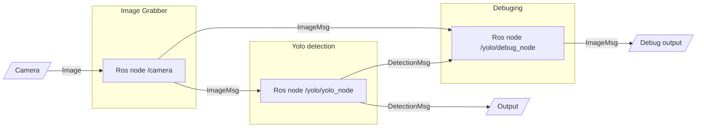

# delogy-cv
This project realize fire detector detection in image using YOLO model.  

```mermaid
graph LR
    A@{ shape: lean-r, label: "Camera" }
    F@{ shape: lean-r, label: "Debug output" }
    G@{ shape: lean-r, label: "Output" }
    A -->|Image| B[Ros node /camera]
    subgraph Image Grabber
    B
    end
    subgraph Yolo detection
    B -->|ImageMsg| C[Ros node /yolo/yolo_node]
    end
    subgraph Debuging
    B -->|ImageMsg| D[Ros node /yolo/debug_node]
    C -->|DetectionMsg| D
    end
    D -->|ImageMsg| F
    C -->|DetectionMsg| G
```
